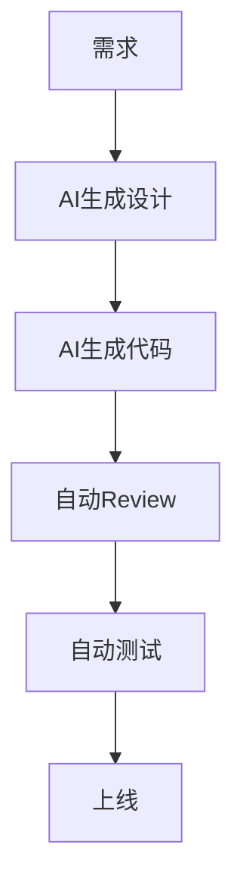

# 🚀 AI工程化团队规范（企业级）

适用于：

- Vue3 + TS
    
- React + TS
    
- Node.js / NestJS
    
- Vben Admin
    
- Monorepo
    
- AI协作开发团队
    

目标：

建立一套真正适合 AI Coding 时代的：

```text
需求
 ↓
Prompt
 ↓
AI生成设计
 ↓
AI生成代码
 ↓
自动Review
 ↓
自动测试
 ↓
自动文档
 ↓
上线
```

最终实现：

- AI可控
    
- 工程稳定
    
- 团队协同
    
- 可维护
    
- 可扩展
    

---

# 🧠 一、AI Prompt 标准化（核心）

---

# 📌 1.1 Prompt 必须模板化（强制）

团队禁止自由发挥 Prompt。

统一结构：

```text
【任务目标】
实现什么功能

【业务背景】
为什么做

【技术栈】
Vue3 + TS + Vben Admin

【输入输出】
输入
输出

【工程约束】
- strict mode
- 禁止 any
- hooks拆分
- API独立
- 单组件职责

【输出要求】
1. 设计方案
2. 类型设计
3. 核心代码
4. 测试方案
```

---

# 📌 1.2 Prompt 分层（企业级）

---

## Level 1：业务Prompt

产品需求。

例如：

```text
实现用户管理页面
```

---

## Level 2：工程Prompt

技术实现约束。

```text
必须符合Vue3 Composition API规范
```

---

## Level 3：架构Prompt

系统级约束。

```text
必须模块化
必须支持扩展
必须支持测试
```

---

# 📌 1.3 Prompt 仓库（推荐）

```text
prompts/
├── frontend/
├── backend/
├── review/
├── testing/
└── architecture/
```

---

# 🧱 二、代码风格统一（强制）

---

# 📌 2.1 ESLint统一

必须：

```bash
eslint
typescript-eslint
eslint-plugin-unicorn
eslint-plugin-import
eslint-plugin-vue
```

---

# 📌 2.2 Prettier统一

统一：

- 单引号
    
- semi
    
- trailingComma
    

---

# 📌 2.3 TypeScript严格模式

必须：

```json
{
  "strict": true,
  "noImplicitAny": true
}
```

---

# 📌 2.4 命名规范

---

## 组件：

```text
UserTable.vue
```

---

## hooks：

```text
useUserTable.ts
```

---

## API：

```ts
getUserList
createUser
updateUser
```

---

# 🚨 三、AI生成代码红线（非常重要）

---

# 直接拒绝 PR：

- ❌ any
    
- ❌ 超长函数
    
- ❌ console.log
    
- ❌ 页面超过300行
    
- ❌ UI和业务逻辑混写
    
- ❌ 无错误处理
    
- ❌ 重复代码
    

---

# 🧠 四、模块化架构规范（核心）

---

# 📌 页面结构

```text
views/user/
├── index.vue
├── model.ts
├── service.ts
├── hooks.ts
├── constants.ts
├── utils.ts
└── components/
```

---

# 📌 职责分离

|文件|职责|
|---|---|
|index.vue|UI|
|service.ts|API|
|hooks.ts|业务逻辑|
|model.ts|类型|
|utils.ts|数据处理|

---

# 📌 Store规范

store只放：

- 用户信息
    
- 权限
    
- 全局状态
    

禁止：

- 页面临时状态
    

---

# 🤖 五、自动Review机器人（关键）

---

# 📌 自动Review流程

```text
PR
 ↓
GitHub Actions
 ↓
ESLint
 ↓
Type Check
 ↓
AST分析
 ↓
AI分析
 ↓
自动评论PR
```

---

# 📌 Review检查项

---

## 类型安全

- any
    
- unknown滥用
    
- 类型缺失
    

---

## 架构

- 单一职责
    
- 模块化
    
- hooks拆分
    

---

## Vue3专项

- watch滥用
    
- computed缺失
    
- store污染
    

---

## 性能

- 重复渲染
    
- O(n²)
    
- deep watch
    

---

## 安全

- XSS
    
- eval
    
- innerHTML
    
- token泄漏
    

---

# 📦 六、设计文档自动生成（非常关键）

---

# 📌 自动生成：

```text
需求文档
 ↓
接口文档
 ↓
类型文档
 ↓
架构图
 ↓
流程图
```

---

# 📌 推荐工具

|功能|工具|
|---|---|
|Markdown|Obsidian|
|API文档|Swagger|
|架构图|Mermaid|
|知识库|Docusaurus|

---

# 📌 Mermaid规范（推荐）



---

# ⚙️ 七、CI/CD工程规范

---

# 📌 PR 必须检查

```text
eslint
typecheck
test
build
review-bot
```

---

# 📌 合并门禁

必须：

```text
✔ lint通过
✔ 类型通过
✔ review通过
✔ coverage > 70%
✔ 无高危漏洞
```

---

# 🧪 八、测试工程化

---

# 📌 测试层级

|类型|工具|
|---|---|
|Unit|Vitest|
|Component|Testing Library|
|E2E|Playwright|

---

# 📌 AI自动生成测试

AI必须输出：

```text
1. 正常测试
2. 边界测试
3. 异常测试
4. 空值测试
```

---

# 🧠 九、AI协作开发 SOP（企业级）

---

# 🚀 标准流程

```text
需求
 ↓
Prompt标准化
 ↓
AI生成设计
 ↓
人工审核架构
 ↓
AI生成代码
 ↓
自动Review
 ↓
自动测试
 ↓
PR
 ↓
CI
 ↓
Merge
```

---

# 📌 十、团队角色分工（推荐）

|角色|职责|
|---|---|
|产品|PRD|
|架构师|Prompt & Architecture|
|AI工程师|AI工作流|
|前端|实现|
|Reviewer|审查|

---

# 🚀 十一、企业级升级方向（未来）

---

# 🔥 AI Agent 化

未来：

```text
需求Agent
 ↓
架构Agent
 ↓
编码Agent
 ↓
测试Agent
 ↓
Review Agent
```

---

# 🔥 MCP 化（下一代）

未来：

- Cursor MCP
    
- Claude MCP
    
- Tool Calling
    
- 企业知识库
    
- 自动上下文治理
    