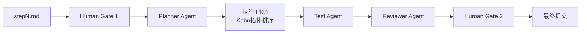
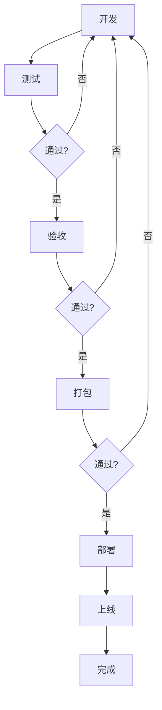

# AI驱动开发全流程：Cursor工作流手册

> **文档版本**: v1.0.0
> **创建日期**: 2026-05-09
> **目标读者**: 开发团队、PM、PMO、架构师

---

## 一、文档目的

本文档整合以下三部分内容，形成完整的 AI 驱动开发方法论：

| 来源 | 核心内容 |
|------|----------|
| `AI驱动开发项目全流程：完整步骤.md` | 12阶段标准项目生命周期 |
| `AI 驱动开发全流程: Claude Code and Cursor.md` | Claude/Cursor 工具分工与用法 |
| `.cursor/prompts/` | 6个 Agent 角色定义与调度机制 |

---

## 二、12阶段全生命周期 × Agent 映射

| 阶段 | 核心角色 | Human Gate | Claude 作用 | Cursor 作用 | 输出物 |
|------|----------|------------|-------------|-------------|--------|
| **1. 立项** | PMO + 技术负责人 | ✅ HG1 前置 | 可行性/竞品/收益分析 | - | 立项书 |
| **2. 需求** | PM + 业务方 | ✅ PMO HG | PRD 生成、需求拆解 | 整理/格式化 | PRD 文档 |
| **3. 架构** | 架构师 + Tech Lead | ✅ Tech Lead HG | 架构/AI模块/全栈方案 | 本地预览/调整 | 架构文档 |
| **4. 初始化** | 开发组长 | - | 骨架/规范/依赖 | 项目Rules/目录/初始化 | 可运行项目 |
| **5. 开发** | Frontend/Backend Agent | - | 复杂代码/全文件生成 | 补全/内联/调试 | 代码 |
| **6. 测试** | Test Agent | ✅ Test HG | AI专项测试设计 | 单元测试/运行/联调 | 测试报告 |
| **7. 验收** | Reviewer Agent | ✅ HG2 复审 | 验收文档生成 | 整理/导出 | 验收报告 |
| **8. 打包** | DevOps | - | Dockerfile/部署脚本 | 本地构建/验证 | 镜像/包 |
| **9. 部署** | 运维 | - | 多环境部署方案 | 本地调试 | 运行服务 |
| **10. 运维** | 运维 + 研发 | - | 日志分析/监控设计 | 告警处理/热更 | 监控告警 |
| **11. 迭代** | PM + 开发 | HG1 新需求 | 优化方案生成 | 开发实现 | 新版本 |

---

## 三、Human Gate 双审机制

### 3.1 Human Gate 1（执行前审查）

**触发时机**：stepN.md 提交执行前

**检查内容**：

| 检查类型 | 检查项 |
|----------|--------|
| **PMO 检查** | 背景目标清晰、Out of Scope 明确、验收标准可执行、P0 缺失风险 |
| **Security 检查** | 安全扫描、合规校验（权限/脱敏/审计/等保） |
| **质量检查** | 可执行、可验收、可回溯 |

**决策格式**：

| 决策 | 条件 |
|------|------|
| **PASS** | 所有检查项通过，可继续执行 |
| **CONDITIONAL** | 非核心项未达标，但不影响主路径 |
| **REJECT** | 核心项缺失，必须修复后才能继续 |

> ⚠️ 如果 REJECT，停止执行，返回修正

---

### 3.2 Human Gate 2（执行后审查）

**触发时机**：所有 todos 完成、Review 通过后

**检查内容**：

| 检查项 | 说明 |
|--------|------|
| **结果校验** | 是否符合预期、无漏洞、无敏感数据 |
| **日志校验** | 操作已记录、可追溯 |

**决策格式**：同 Human Gate 1

> ⚠️ 如果 REJECT，执行回滚并修复

---

## 四、Agent 角色体系

### 4.1 Agent 角色矩阵

| Agent | prompt 文件 | 职责 | 输入 | 输出 |
|-------|-------------|------|------|------|
| **总控 (Tech Lead)** | `00-run-all.md` | 调度全局流程、控制闭环 | stepN.md | Git 历史 + Plan 文件 |
| **Planner** | `01-planner.md` | 拆解 step 为可执行 Plan | stepN.md | stepN-plan.md |
| **Frontend** | (隐式) | 执行 frontend 类型 todos | Plan todos | 组件代码 |
| **Backend** | `03-backend.md` | 实现 API 接口 | Plan todos | 后端代码 |
| **Test** | `04-test.md` | 实测验证 + 生成报告 | step.md 测试用例 | 测试报告 |
| **Reviewer** | `05-reviewer.md` | 审查 acceptance 完成度 | Plan 文件 | 审查结论 |

### 4.2 总控 Agent（00-run-all.md）

**职责**：从 step 自动完成整个开发周期

**执行流程**：

```
Human Gate 1（执行前）
        ↓
Planner - 生成 Plan
        ↓
执行 Plan（按拓扑排序）
        ↓
Test Agent - 实测验证
        ↓
Reviewer Agent - 审查
        ↓
Human Gate 2（执行后）
        ↓
最终提交
```

**调度规则**：

```yaml
# Plan 中的 todos 结构
todos:
  - id: todo-1
    type: frontend      # Frontend Agent 执行
    depends_on: []       # 无依赖，立即执行
  - id: todo-2
    type: backend       # Backend Agent 执行
    depends_on: [todo-1]  # 依赖 todo-1
  - id: todo-3
    type: test          # Test Agent 执行
    depends_on: [todo-1, todo-2]  # 依赖多个
```

**执行顺序**：Kahn's Algorithm 拓扑排序，确保依赖顺序

### 4.3 Planner Agent（01-planner.md）

**职责**：读取 stepN.md，拆解为可执行 Plan

**输出要求**：

```markdown
# stepN-plan.md

## todos
| id | type | content | depends_on |
|----|------|---------|------------|
| todo-1 | frontend | 实现上传组件UI | [] |
| todo-2 | backend | 实现文件上传API | [todo-1] |
| todo-3 | test | 测试上传功能 | [todo-2] |

## files
- packages/frontend/src/components/Upload.vue
- packages/backend/src/api/file.ts

## acceptance
- [ ] 文件上传成功
- [ ] 文件大小限制生效
```

### 4.4 Test Agent（04-test.md）

**职责**：执行实测测试，生成可追溯测试报告

**强制要求**：

1. **必须实测** - 不允许只填"✓"，必须有实际命令和输出
2. **每个用例都要验证** - 不能跳过任何测试用例
3. **失败必须记录** - FAIL 的用例必须说明原因

**测试报告格式**：

```markdown
## 🧪 测试报告

### 测试汇总

| 用例ID | 测试场景 | 状态 | 备注 |
|--------|---------|------|------|
| TC-001 | 用户登录成功 | ✅ PASS | - |
| TC-002 | 用户名错误 | ✅ PASS | - |

**总计**: 2 通过 / 0 失败
```

### 4.5 Reviewer Agent（05-reviewer.md）

**职责**：检查 Plan 是否完成

**检查内容**：

1. todos 是否全部 done
2. acceptance 是否满足
3. 是否有 bug / 不一致

**失败闭环**：

```
Review 不通过
    ↓
回到对应 Agent（Frontend/Backend/Test）修复
    ↓
重新 Review
    ↓
最大重试: 3 次
    ↓
超过限制 → 标记失败，人工介入
```

---

## 五、Claude + Cursor 双剑合璧

### 5.1 工具分工

| 工具 | 擅长场景 | 使用方式 |
|------|----------|----------|
| **Claude** | 复杂逻辑、长上下文、架构设计、全文件生成 | 网页版 / CLI 版 |
| **Cursor** | 实时补全、内联修改、单文件调试、本地运行 | AI IDE（Ctrl+I / Tab / Ctrl+K / Ctrl+L） |

### 5.2 开发模式

#### 模式A：复杂模块 → Claude 生成 → Cursor 优化（推荐）

```
1. Claude 生成完整模块（一次性输出全套可运行代码）
2. Cursor 本地落地（复制 → Tab 补全 → 格式化）
3. Cursor 聊天优化（Ctrl+L: 优化命名、补类型、修复ESLint）
```

#### 模式B：快速迭代 → Cursor 写 → Claude 深度优化

```
1. Cursor 快速写（Tab 补全、Ctrl+K 单文件修改）
2. Claude 深度优化（发给 Claude: 性能/可读性/安全）
```

#### 模式C：AI 模块（RAG/Prompt/Agent）→ Claude 主导

```
1. Claude 设计 Prompt + 生成 RAG 全流程代码
2. Cursor 本地调试（运行/日志/边界）
```

### 5.3 Cursor Rules（项目基石）

```markdown
# .cursor/rules/coding-standards.md

技术栈：Vue3 + TypeScript + Vite
目录：src/components, src/views, src/router, src/store
注释：必写 JSDoc，函数/接口/类都要有说明
风格：ESLint 标准，变量小驼峰，常量全大写
安全：敏感数据加密，接口必鉴权
```

> ⚠️ 必须写 .cursor/rules，团队统一，AI 才不乱写

---

## 六、完整工作流

### 6.1 step → Plan → 执行 → 验收

```
┌─────────────────────────────────────────────────────────────┐
│  stepN.md                                                   │
│  （一个 step = 一个独立功能模块）                              │
└─────────────────────────────────────────────────────────────┘
                            ↓
┌─────────────────────────────────────────────────────────────┐
│  Human Gate 1（执行前审查）                                  │
│  - PMO 检查：背景/目标/验收标准/优先级                        │
│  - Security 检查：安全/合规/权限                              │
│  - 决策：PASS / CONDITIONAL / REJECT                        │
└─────────────────────────────────────────────────────────────┘
                            ↓
┌─────────────────────────────────────────────────────────────┐
│  Planner Agent → 生成 stepN-plan.md                         │
│  - todos（带 type 和 depends_on）                            │
│  - files（涉及文件）                                         │
│  - acceptance（验收标准）                                     │
└─────────────────────────────────────────────────────────────┘
                            ↓
┌─────────────────────────────────────────────────────────────┐
│  执行 Plan（Kahn 拓扑排序）                                   │
│  - 无依赖的 todo 并行执行                                     │
│  - 有依赖的 todo 等待前置完成                                 │
│  - 根据 type 分配 Agent（Frontend/Backend/Test）              │
└─────────────────────────────────────────────────────────────┘
                            ↓
┌─────────────────────────────────────────────────────────────┐
│  Test Agent → 实测验证                                       │
│  - 执行 step.md 中的测试用例                                 │
│  - 生成测试报告（实际命令+输出）                               │
│  - 写入 stepN-plan.md                                        │
└─────────────────────────────────────────────────────────────┘
                            ↓
┌─────────────────────────────────────────────────────────────┐
│  Reviewer Agent → 审查                                       │
│  - todos 全部完成？                                          │
│  - acceptance 全部满足？                                     │
│  - 有无 bug/不一致？                                         │
└─────────────────────────────────────────────────────────────┘
                            ↓
┌─────────────────────────────────────────────────────────────┐
│  Human Gate 2（执行后复审）                                  │
│  - 结果校验：符合预期/无漏洞/无敏感数据                        │
│  - 日志校验：操作已记录/可追溯                                 │
│  - 决策：PASS / CONDITIONAL / REJECT                        │
└─────────────────────────────────────────────────────────────┘
                            ↓
┌─────────────────────────────────────────────────────────────┐
│  最终提交                                                    │
│  git add . && git commit -m "feat(stepN): 全部完成+验收通过"  │
└─────────────────────────────────────────────────────────────┘
```

**Mermaid 流程图**：



### 6.2 反馈循环（测试/验收/打包/部署任一阶段发现问题）

**文字描述**：

> **循环逻辑**：测试/验收/打包/部署任一阶段发现问题 → 回到开发重新修复 → 重新走完整个流程（开发→测试→验收→打包→部署）→ 再次验收通过后才能继续

**ASCII 流程图**：

```
                    ┌──────────────────────────────────────┐
                    │                                      ↓
开发 ──→ 测试 ──→ 验收 ──→ 打包 ──→ 部署 ──→ 上线 ──→ 完成
  ↑         │                                      │
  │         │  ←─── 发现问题 ────                  │
  │         ↓                                       │
  └─────────┴────────── 重试 ───────────────────────┘
              (最多重试3次)
```

**Mermaid 流程图**：



**循环控制**：
- 最大重试次数：3 次（由 Reviewer Agent 控制）
- 超过限制 → 标记失败，人工介入

**问题分类处理**：

| 发现阶段 | 问题类型 | 处理方式 |
|----------|----------|----------|
| 测试 | 功能 bug / 边界问题 | 回到对应 Agent 修复 → 重新测试 |
| 验收 | acceptance 不满足 | 回到对应 Agent 修复 → 重新验收 |
| 打包 | 构建失败 / 依赖问题 | 修复构建脚本 → 重新打包 |
| 部署 | 环境配置 / 权限问题 | 修复部署配置 → 重新部署 |

### 6.3 Git 提交规范

| 类型 | 使用场景 | 示例 |
|------|----------|------|
| feat | frontend / backend 功能 | `feat(step1): 完成 todo-1 上传组件UI` |
| fix | bug 修复 | `fix(step1): 修复 todo-2 接口错误` |
| test | 测试相关 | `test(step1): 增加 todo-3 测试用例` |

**防止空提交**：如果没有代码变更，跳过 git commit，记录日志"无变更"

---

## 七、AI 专项测试（测试阶段必加）

### 7.1 测试类型

| 测试类型 | 测试内容 | 验收标准 |
|----------|----------|----------|
| **功能测试** | 正常流程、分支覆盖、边界值 | 通过率 100% |
| **幻觉测试** | 生成误导问题，检查是否胡编 | 幻觉率 < 5% |
| **上下文测试** | 多轮对话一致性 | 上下文保持率 > 90% |
| **知识库准确率** | 检索精度、漏检/错检 | 召回率 > 80% |
| **安全测试** | Prompt 注入、越权、敏感泄露 | 无注入成功 |
| **压力测试** | 并发、延迟、超时 | 响应时间 < 2s |

### 7.2 对抗性测试

- **Prompt 注入**：故意输入诱导性内容，检验是否被操纵
- **边界恶意输入**：超长输入、特殊字符、SQL 注入等
- **并发测试**：多人同时操作，检验数据一致性

---

## 八、关键注意事项

### 8.1 人在回路（Human-in-the-Loop）

- **所有产出必须人工评审**：代码、架构、需求、测试
- **核心逻辑/安全/支付/权限**：人写为主，AI 辅助

### 8.2 Prompt 质量

- 清晰：语言、功能、输入输出、规范、边界、安全
- 模板化：`任务 + 规则 + 上下文 + 输出格式 + 验收标准`

### 8.3 迭代闭环

```
收集问题
    ↓
Claude 分析
    ↓
生成优化方案
    ↓
Cursor 开发
    ↓
测试
    ↓
上线
```

---

## 九、附录

### 9.1 Agent 调用速查

| Agent | 调用方式 | 说明 |
|-------|----------|------|
| Planner | `/planner stepN` | 生成 Plan |
| Frontend | 读取 Plan 中 type=frontend 的 todos | 执行前端任务 |
| Backend | `/backend stepN` | 执行后端任务 |
| Test | `/test stepN` | 执行测试并生成报告 |
| Reviewer | `/reviewer stepN` | 审查并验证 acceptance |

### 9.2 Human Gate 决策模板

```markdown
## Human Gate 决策

| 项目 | 内容 |
|------|------|
| Gate 类型 | PM / PMO / Security |
| 提交时间 | YYYY-MM-DD HH:mm |
| 决策 | PASS / CONDITIONAL / REJECT |
| 决策依据 | ... |
| 整改要求（如有） | ... |
| 整改期限（如有） | ... |
| 签字 | ___ |
```

### 9.3 相关文档索引

| 文档 | 位置 |
|------|------|
| AI驱动开发项目全流程 | `docs/AI驱动开发项目全流程：完整步骤.md` |
| Claude Code + Cursor 全流程 | `docs/AI 驱动开发全流程: Claude Code and Cursor.md` |
| Cursor Agent Prompts | `.cursor/prompts/` |
| Cursor Rules | `.cursor/rules/` |
| v2 产品路线图 | `docs/requirements/v2_product_roadmap.md` |

---

## 十、最佳实践总结

> **Claude 做大设计、全文件、复杂AI逻辑 → Cursor 做本地开发、实时补全、调试、优化 → 人工评审 → 测试 → 部署 → 监控迭代**

**核心原则**：

1. **Human Gate 双审**：执行前 + 执行后，不可跳过
2. **AI 是工具**：不替代产品、架构、测试、运维
3. **实测验证**：每个功能都要实际运行验证
4. **统一规范**：Cursor Rules + Git 规范 + Commit 类型
5. **失败闭环**：Review 不通过 → 重试(≤3次) → 人工介入