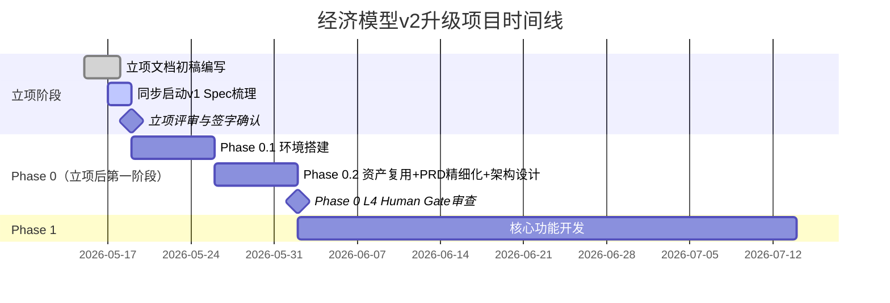

# 时间线澄清与执行逻辑
**不是**“立项完成后再生成PRD”，也不是“立项和PRD完全并行”，而是**“立项过程后半段启动PRD基础工作，立项签字确认后立即进入PRD精细化拆解；架构设计完全嵌入Phase 0（立项后的第一阶段），与资产复用分析同步进行”**。

## 一、完整时间线与工作边界

### 关键时间节点说明
1. **立项前3天**：只写**立项约束性文档**（目标、红线、里程碑、资源、风险），不写PRD和架构
2. **立项最后2天**：同步启动**v1现有业务逻辑的Spec梳理**（PRD的基础层），不需要等立项签字
3. **立项签字当天**：立即进入Phase 0.1环境搭建，同时PRD从“基础梳理”转入“精细化拆解”
4. **Phase 0.2（第2周）**：架构设计与PRD精细化、资产复用分析**三者完全并行**，共同作为Phase 0的交付物

## 二、为什么不能用传统的“立项→PRD→架构”串行模式
### 1. 这是T4核心系统升级，不是T1/T2新项目
- **T1/T2新项目**：需求是未知的，必须先立项定方向，再写PRD，再做架构
- **T4升级项目**：90%的需求是**v1已经存在且验证过的**，PRD的核心不是“创造新需求”，而是“固化已有Spec”
- 我们在立项过程中就可以开始梳理v1的现有逻辑，不需要等立项完全结束

### 2. 架构设计必须基于立项的约束，不能单独前置
- 架构设计的核心不是“设计一个完美的新系统”，而是“在满足100%兼容v1、双写、回滚等约束下的技术方案”
- 如果在立项前就做架构，很容易忽略这些硬约束，导致架构方案完全不可用
- 架构设计必须和**资产复用分析**同步进行，因为很多架构决策取决于v1有哪些可以复用的资产

## 三、各阶段PRD与架构设计的具体工作内容
### 1. 立项过程中（最后2天）：PRD基础层梳理
**核心工作**：把v1已有的、不可变更的业务逻辑固化为Spec
- 梳理v1所有公式的语法、计算规则、边界条件
- 梳理v1所有数据格式、数据库表结构、Excel模板格式
- 梳理v1版本状态机、权限控制矩阵
- 梳理v1所有用户操作流程和交互逻辑

**输出**：《v1业务逻辑Spec初稿》（PRD的基础部分）

### 2. 立项完成后（Phase 0.2）：PRD精细化拆解
**PRD分层结构**：
| 层级 | 内容 | 负责人 | 完成时间 |
|------|------|--------|----------|
| **基础层（不可变更）** | v1所有业务逻辑、数据格式、交互规范的完整Spec | 产品经理+Test Agent | Phase 0.2第3天 |
| **迁移层（必须实现）** | 每个功能模块的迁移需求、验收标准、一致性验证方法 | 产品经理+Planner Agent | Phase 0.2第5天 |
| **增量层（可选）** | 多人协作、RAG助手等新增功能的需求 | 产品经理 | Phase 0.2第7天 |

**关键要求**：
- 基础层和迁移层必须100%覆盖v1所有核心功能
- 每个迁移需求都必须有明确的**一致性验收标准**（比如“公式计算结果与v1误差<0.0001%”）
- 增量层需求不能影响基础层和迁移层的实现

### 3. 立项完成后（Phase 0.2）：架构设计同步进行
**架构设计核心内容**：
1. **兼容性架构**：v1和v2的数据格式转换、接口兼容、双写机制
2. **数据迁移架构**：全量迁移+增量同步方案、数据一致性校验方案
3. **回滚架构**：一键回滚流程、数据回滚方案、业务回滚方案
4. **分阶段部署架构**：灰度发布方案、流量切换方案、监控告警方案
5. **核心模块架构**：公式引擎迁移方案、Yjs协作层架构、Supabase后端架构

**输出**：《系统架构设计文档》+《数据迁移方案》+《双写与回滚预案》

**关键要求**：
- 所有架构决策都必须满足立项文档中的核心约束
- 优先复用v1的资产，减少重复开发
- 架构设计必须考虑后续的可测试性和可运维性

## 四、Human Gate节点与交付物关系
| Human Gate节点 | 必须提交的PRD/架构交付物 | 审查重点 |
|----------------|--------------------------|----------|
| **Phase 0 L4审查** | 1. 完整的PRD文档（基础层+迁移层+增量层） 2. 系统架构设计文档 3. 数据迁移方案 4. 双写与回滚预案 | 1. PRD是否100%覆盖v1核心功能 2. 兼容性方案是否可行 3. 回滚预案是否完善 4. 所有风险是否都有应对措施 |
| **Phase 1 L3审查** | 1. 核心功能模块详细设计文档 2. 测试用例文档 | 1. 功能实现是否符合PRD要求 2. 公式计算一致性是否有保障 3. 测试覆盖是否充分 |

## 五、总结：与传统模式的核心区别
| 模式 | 传统串行模式 | T4升级项目并行模式 |
|------|--------------|--------------------|
| 流程 | 立项→PRD→架构→开发 | 立项（后半段启动PRD基础）→Phase 0（PRD精细化+架构设计并行）→开发 |
| PRD核心 | 定义新需求 | 固化已有Spec |
| 架构核心 | 设计新系统 | 在约束下设计兼容方案 |
| 优势 | 逻辑清晰，边界明确 | 缩短周期2-3周，提前暴露风险，确保所有工作围绕主线展开 |

**一句话总结**：立项是定规则，PRD是把v1的规则写清楚，架构是在规则下设计技术方案。这三者不是完全串行，而是**规则先定，然后PRD和架构在规则下并行展开**。