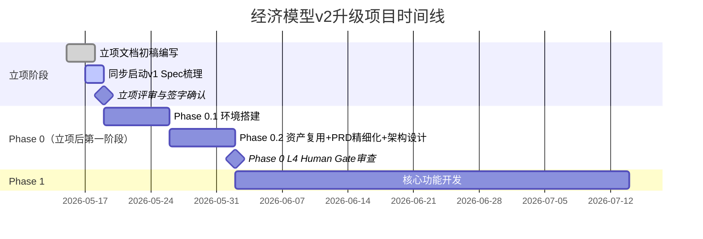

# 「v1_v2 经济模型新版升级」立项闭环完整执行方案

## 核心目标

- 完成「立项」闭环（核心是固化项目约束）
- 立项不是单纯走流程，而是把项目核心配置（兼容原则、分阶段规则、风险控制、AI 角色）固化为立项文档，明确项目边界、资源、里程碑，避免后续需求 / 架构偏离核心目标。
- 将之前所有共识（项目类型、主线、配置规则、AI角色分工）**固化为具有约束力的正式文档**，明确项目边界、红线、里程碑和责任分工，从根源上避免后续需求蔓延、架构偏离和风险失控。

## 背景

结合 "v1_v2 经济模型新版升级" 的项目主线 + 核心配置要点 + AI 角色映射，下一步优先完成「立项闭环」

## 核心立项动作


- 明确项目里程碑：对齐 Phase 0（资产复用）→Phase 1（核心功能）→Phase 2（协作 + 后端）→Phase 3（AI 助手）的阶段划分，确定每个阶段的交付物、Human Gate 审查节点、灰度发布周期；
- 固化核心约束：把 "100% 兼容 v1""双写机制""一键回滚""AI 角色 - 阶段 / 模块映射" 写入立项文档，作为需求 / 架构设计的不可突破原则；
- 资源对齐：基于 AI 角色映射（如 Planner Agent/PM Agent / 技术负责人），确定各阶段的人力 / AI 工具（Cursor 角色体系）配置。

---

## 一、时间线与工作边界

### 1.1 执行逻辑

> **不是** "立项完成后再生成PRD"，也不是"立项和PRD完全并行"，而是 **"立项过程后半段启动PRD基础工作，立项签字确认后立即进入PRD精细化拆解；架构设计完全嵌入Phase 0（立项后的第一阶段），与资产复用分析同步进行"**。

详见：1.4 不同项目类型的时间线对比

### 1.2 完整时间线



### 1.3 关键时间节点说明

| 节点 | 时间 | 工作内容 | 说明 |
|------|------|----------|------|
| 立项前3天 | Day 1-3 | 只写**立项约束性文档**（目标、红线、里程碑、资源、风险） | 不写PRD和架构 |
| 立项最后2天 | Day 3-5 | 同步启动**v1现有业务逻辑的Spec梳理**（PRD的基础层） | 不需要等立项签字 |
| 立项签字当天 | Day 5 | 立即进入Phase 0.1环境搭建，同时PRD从"基础梳理"转入"精细化拆解" | - |
| Phase 0.2 | Day 6-12 | 架构设计与PRD精细化、资产复用分析**三者完全并行** | 共同作为Phase 0的交付物 |

### 1.4 不同项目类型的时间线对比

#### 1.4.1 T1/T2 新项目：传统串行模式

```plaintext
立项 → PRD → 架构设计 → 开发
```

**原因**：需求未知，必须先探索方向，再定义需求，最后设计架构。

---

#### 1.4.2 T4 核心系统升级：并行模式

```plaintext
立项（后半段启动PRD基础） → Phase 0（PRD精细化 + 架构设计并行） → 开发
```

**原因**：

- 90% 需求是 v1 已验证过的，PRD 的核心是"固化已有 Spec"而非"创造新需求"
- 架构设计必须基于立项的约束（100% 兼容、双写、回滚），不能单独前置
- 很多架构决策取决于 v1 有哪些可复用的资产，必须与资产复用分析同步

---

> **一句话总结**：立项是定规则，PRD 是把 v1 的规则写清楚，架构是在规则下设计技术方案。这三者不是完全串行，而是**规则先定，然后 PRD 和架构在规则下并行展开**。

---

## 二、立项文档核心结构（必须包含的约束性内容）

### 2.1 项目基本信息（定调）

| 项 | 内容 | 约束说明 |
|----|------|----------|
| 项目名称 | 经济模型系统v2.0升级项目 | 明确版本号，避免与v1混淆 |
| 项目类型 | T4 - 核心系统大升级 | 强制使用T4开发模式，所有流程必须遵循T4配置 |
| 项目周期 | 13周（Phase 0-2）+ 4周（Phase 3可选） | 不含后续运维和优化 |
| 核心目标 | 在100%兼容v1业务逻辑和数据的前提下，完成核心技术栈换代，引入多人实时协作能力 | 这是整个项目的唯一主线，任何偏离此目标的需求都必须被拒绝 |
| 项目负责人 | [技术负责人姓名] | 对项目整体成败负责，拥有最终决策权 |

### 2.2 不可突破的核心约束（立项的灵魂，必须全员签字确认）

> ❗ 所有以下条款为**不可协商的红线**，任何变更必须经过项目负责人+业务负责人+技术委员会三方审批，并更新立项文档。

#### 2.2.1 业务兼容性约束（最高优先级）

- ✅ **计算结果100%一致**：v2所有公式计算结果必须与v1完全相同（误差<0.0001%），任何差异都视为P0级bug
- ✅ **数据格式100%兼容**：v1的所有Excel模板、导出文件、数据库结构必须在v2中正常使用
- ✅ **业务逻辑零变更**：升级过程中**绝对不允许**修改任何v1已验证的业务逻辑，不允许添加任何新的业务功能
- ✅ **用户体验无缝切换**：用户操作习惯、界面布局、快捷键必须与v1保持一致，不允许在升级过程中进行UI改版

#### 2.2.2 技术风险约束

- ✅ **双写机制强制**：上线初期必须同时运行v1和v2系统，双写周期不少于3个月
- ✅ **一键回滚保证**：任何时候都必须能够在**30分钟内**完整回滚到v1系统，回滚后数据零丢失
- ✅ **灰度发布强制**：流量切换必须分阶段进行：1%→5%→20%→50%→100%，每个阶段至少观察7天
- ✅ **新技术引入限制**：除了已确定的HyperFormula、Yjs、Supabase外，不允许引入任何其他未经验证的新技术

#### 2.2.3 开发模式约束

- ✅ **业务层100% Spec Coding**：所有业务逻辑必须先写Spec，再生成代码，不允许直接写代码
- ✅ **Human Gate强制**：所有阶段必须通过对应的Human Gate审查才能进入下一阶段
- ✅ **AI角色分工强制**：所有开发工作必须按照AI角色映射表执行，明确AI和人类的职责边界

### 2.3 分阶段里程碑与Human Gate节点（固化T4配置）

| 阶段 | 子阶段 | 周期 | 核心交付物 | Human Gate等级 | 审查人 | 通过标准 | 负责AI角色 |
|------|--------|------|------------|----------------|--------|----------|------------|
| **Phase 0：项目初始化与方案设计** | **子阶段0.1：项目初始化与环境搭建** | 1周 | 1. 项目代码仓库与Git工作流配置<br>2. Cursor AI角色体系完整导入<br>3. 开发/测试/预生产环境搭建<br>4. CI/CD流水线配置<br>5. v1生产环境镜像与数据备份<br>6. 双写测试环境准备 | L2（标准） | 技术负责人+运维负责人 | 所有环境可正常访问<br>AI角色规则文件全部生效<br>v1镜像数据完整可用<br>CI/CD可自动构建部署 | Frontend Agent、Backend Agent、Deploy Agent、DBA Agent |
| | **子阶段0.2：资产复用与方案设计** | 1周 | 1. v1资产复用分析报告<br>2. 兼容性整体方案<br>3. 数据迁移方案<br>4. 双写与回滚预案 | L4（极其严格） | 技术负责人+业务负责人+测试负责人 | 所有核心风险已识别并制定应对措施<br>兼容性方案覆盖100%v1核心功能<br>回滚预案经过演练验证 | Planner Agent、PM Agent、Tech Lead Agent |
| **Phase 1：核心功能迁移** | | 6周 | 1. 表格编辑功能<br>2. HyperFormula公式引擎（含v1财务函数）<br>3. 版本管理与状态机<br>4. Excel导入导出 | L3（严格） | 技术负责人+测试负责人 | 所有v1核心功能在v2中正常运行<br>公式计算结果与v1完全一致<br>单元测试覆盖率≥80% | Frontend Agent、Vue3 Agent、Test Agent |
| **Phase 2：协作与后端升级** | | 4周 | 1. Yjs多人实时协作<br>2. Supabase后端集成<br>3. 全链路监控体系<br>4. 灰度发布系统 | L3→L4 | 技术负责人+运维负责人+安全负责人 | 支持10人同时编辑无冲突<br>数据一致性100%<br>系统可用性≥99.99% | Backend Agent、Fullstack Agent、Security Agent、Deploy Agent |
| **Phase 3：AI智能助手（可选）** | | 4周 | 1. RAG向量知识库<br>2. 自然语言查询功能<br>3. 数据解读与分析 | L2（标准） | 产品负责人+技术负责人 | 智能助手能够准确回答常见问题<br>不影响核心计算流程 | Spec Coding Agent、RAG Agent |

### 2.4 资源配置（固化AI角色映射）

#### 2.4.1 人力资源配置

| 角色 | 人数 | 职责 |
|------|------|------|
| 技术负责人 | 1 | 整体技术方案、Human Gate L4审查、风险控制 |
| 前端开发 | 2 | 核心功能开发、UI实现、兼容性测试 |
| 后端开发 | 1 | Supabase集成、Yjs服务、数据迁移 |
| 测试工程师 | 1 | 全量回归测试、公式一致性验证、自动化测试 |
| 产品经理 | 1 | 需求确认、用户沟通、验收测试 |

#### 2.4.2 AI工具与角色配置（基于Cursor settings.json）

| 工作环节 | 主要AI角色 | 辅助AI角色 | 规则文件 |
|----------|------------|------------|----------|
| 项目初始化 | Deploy Agent、DBA Agent | Frontend Agent、Backend Agent | deploy-rules.mdc、DBA.mdc |
| 需求分析与方案设计 | Planner Agent、PM Agent | Tech Lead Agent | planner.mdc、PM.mdc、tech-lead.mdc |
| 前端开发 | Frontend Agent、Vue3 Agent | UI Agent | frontend.mdc、vue3.mdc、UI.mdc |
| 后端开发 | Backend Agent、Fullstack Agent | DBA Agent | backend.mdc、fullstack.mdc、DBA.mdc |
| 测试 | Test Agent | Troubleshooting Agent | TEST.mdc、troubleshoot-issues.mdc |
| 代码审查 | Reviewer Agent | Security Agent | reviewer.mdc、security-rules.md |
| 部署 | Deploy Agent | Security Agent | deploy-rules.mdc、security-human-gate.md |

### 2.5 核心风险控制机制（固化T4风险配置）

| 风险 | 触发条件 | 应对措施 | 责任人 |
|------|----------|----------|--------|
| 公式计算结果不一致 | 双写对比差异率>0.001% | 立即暂停流量切换，定位并修复问题，重新进行全量回归测试 | 测试负责人 |
| 数据迁移失败 | 数据丢失或损坏 | 立即回滚到v1系统，恢复备份数据，重新制定迁移方案 | 技术负责人 |
| 多人协作冲突 | 数据不一致或丢失 | 立即关闭协作功能，切换到单人编辑模式，修复数据后重新开启 | 后端开发 |
| 系统性能不达标 | 页面加载>3s或公式计算>100ms | 暂停新功能开发，集中进行性能优化 | 技术负责人 |
| 上线后出现严重bug | 影响核心业务运行 | 立即执行回滚预案，切换到v1系统，修复问题后重新上线 | 运维负责人 |

### 2.6 验收标准（量化可执行）

#### 2.6.1 功能验收

- [ ] 所有v1核心功能在v2中正常运行
- [ ] 公式计算结果与v1完全一致（1000个测试用例全部通过）
- [ ] Excel导入导出功能正常，与v1格式完全兼容
- [ ] 版本状态机流转正确，权限控制生效
- [ ] 支持10人同时编辑同一模型，无冲突和数据丢失

#### 2.6.2 性能验收

- [ ] 表格加载时间<2s（1000行数据）
- [ ] 公式计算时间<100ms（100个公式）
- [ ] 多人协作同步延迟<100ms
- [ ] 系统可用性≥99.99%

#### 2.6.3 安全验收

- [ ] 敏感数据全程脱敏
- [ ] 完整的操作审计日志
- [ ] 权限矩阵生效，未授权用户无法访问敏感数据
- [ ] 回滚机制正常，30分钟内可完成回滚

---

## 三、立项评审与签字确认（闭环的关键）

### 3.1 评审参与人员（必须全部到场）

- 项目发起人（业务负责人）
- 技术负责人
- 产品经理
- 测试负责人
- 运维负责人
- 安全负责人
- 核心开发人员

### 3.2 评审核心内容（只评审约束性条款）

- 核心目标是否明确，是否符合业务需求
- 不可突破的约束是否合理，是否能够达成
- 分阶段里程碑和交付物是否清晰
- 资源配置是否充足
- 风险控制措施是否有效
- 验收标准是否可量化、可执行

### 3.3 签字确认

所有评审人员必须在立项文档上签字确认，表明已理解并同意遵守所有约束条款。签字后的立项文档将作为项目执行的唯一依据，任何变更必须经过正式的变更流程。

---

## 四、立项后立即执行的3个动作

### 4.1 启动Phase 0.1：项目初始化与环境搭建

- 创建项目代码仓库，配置Git工作流（保护主分支，强制PR和代码审查）
- 初始化Cursor项目，完整导入所有AI角色规则文件（settings.json），验证所有角色可正常调用
- 搭建开发、测试、预生产三套独立环境，配置网络和权限
- 配置CI/CD流水线，实现代码提交后自动构建、测试和部署
- 制作v1生产环境的完整镜像和数据备份，用于开发和测试
- 准备双写测试环境，配置v1和v2系统的网络互通

### 4.2 项目启动会

- 向所有项目成员宣讲立项文档，明确项目目标、约束、里程碑和分工
- 演示Cursor AI角色体系的使用方法，明确AI和人类的职责边界
- 确认每个人的职责和工作安排
- 解答项目成员的疑问，达成共识

### 4.3 启动Phase 0.2：资产复用与方案设计

- 成立Phase 0专项小组（技术负责人+Planner Agent+PM Agent）
- 开始v1资产复用分析，输出《v1资产复用分析报告》
- 开始兼容性方案设计，重点关注公式引擎迁移和数据迁移方案
- 制定详细的双写和回滚预案，并进行初步演练

---

## 五、Phase 0 中PRD与架构设计的并行工作

### 5.1 PRD分层结构

| 层级 | 内容 | 负责人 | 完成时间 |
|------|------|--------|----------|
| **基础层（不可变更）** | v1所有业务逻辑、数据格式、交互规范的完整Spec | 产品经理+Test Agent | Phase 0.2第3天 |
| **迁移层（必须实现）** | 每个功能模块的迁移需求、验收标准、一致性验证方法 | 产品经理+Planner Agent | Phase 0.2第5天 |
| **增量层（可选）** | 多人协作、RAG助手等新增功能的需求 | 产品经理 | Phase 0.2第7天 |

**关键要求**：
- 基础层和迁移层必须100%覆盖v1所有核心功能
- 每个迁移需求都必须有明确的**一致性验收标准**（比如"公式计算结果与v1误差<0.0001%"）
- 增量层需求不能影响基础层和迁移层的实现

### 5.2 架构设计核心内容

1. **兼容性架构**：v1和v2的数据格式转换、接口兼容、双写机制
2. **数据迁移架构**：全量迁移+增量同步方案、数据一致性校验方案
3. **回滚架构**：一键回滚流程、数据回滚方案、业务回滚方案
4. **分阶段部署架构**：灰度发布方案、流量切换方案、监控告警方案
5. **核心模块架构**：公式引擎迁移方案、Yjs协作层架构、Supabase后端架构

**输出**：《系统架构设计文档》+《数据迁移方案》+《双写与回滚预案》

**关键要求**：
- 所有架构决策都必须满足立项文档中的核心约束
- 优先复用v1的资产，减少重复开发
- 架构设计必须考虑后续的可测试性和可运维性

### 5.3 Human Gate节点与交付物关系

| Human Gate节点 | 必须提交的PRD/架构交付物 | 审查重点 |
|----------------|--------------------------|----------|
| **Phase 0 L4审查** | 1. 完整的PRD文档（基础层+迁移层+增量层）<br>2. 系统架构设计文档<br>3. 数据迁移方案<br>4. 双写与回滚预案 | 1. PRD是否100%覆盖v1核心功能<br>2. 兼容性方案是否可行<br>3. 回滚预案是否完善<br>4. 所有风险是否都有应对措施 |
| **Phase 1 L3审查** | 1. 核心功能模块详细设计文档<br>2. 测试用例文档 | 1. 功能实现是否符合PRD要求<br>2. 公式计算一致性是否有保障<br>3. 测试覆盖是否充分 |

---

## 六、立项成功的标志

1. 所有相关方都已签字确认立项文档
2. 项目成员对项目目标、约束和分工有清晰的认识
3. Phase 0.1工作已完成，所有环境和工具链已配置就绪
4. Phase 0.2工作已正式启动（PRD精细化+架构设计并行启动）

---

> 💡 **重要提示**：立项不是一次性的工作，而是贯穿整个项目的过程。在每个Human Gate节点，都需要重新审视立项文档，确保项目没有偏离主线和约束。如果出现重大变更，必须及时更新立项文档并重新评审。
