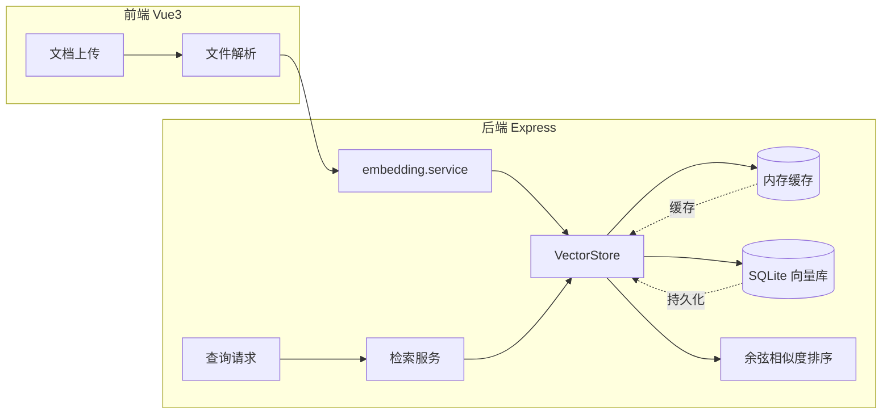

# 任务目标

基于 `better-sqlite3` 将向量块写入本地 SQLite（`packages/backend/data/vectors.db`），改造 `VectorStore.toDatabase()`，服务重启后从库中恢复向量到内存。**文档列表、知识库名称等仍分别为后端内存与前端 Pinia，不在此 SQLite 文件中。**

## 项目背景

原有 `VectorStore` 类使用进程级内存存储（`Map<knowledgeBaseId, VectorItem[]>`），服务重启后数据丢失。本次改造引入 SQLite 向量数据库，实现向量数据持久化存储。

## 任务要求

1. 引入 `better-sqlite3` 实现本地向量块持久化（不依赖 sqlite-vss；检索仍用内存余弦相似度）
2. 新增 `vector-db.service.ts` 服务类，提供向量存储和检索能力
3. 改造 `VectorStore` 类，`addDocument`/`deleteChunks` 等操作后自动同步到数据库
4. 实现 `toDatabase()` 方法，服务启动时加载已有数据到内存
5. 保留内存存储作为缓存层，数据库作为持久层
6. 支持按知识库隔离存储

## 依赖安装

```bash
pnpm add better-sqlite3 -F backend
pnpm add -D @types/better-sqlite3 -F backend
```

## 配置文件

### `.env.example` 更新

```bash
# 向量数据库配置
VECTOR_DB_TYPE=sqlite
VECTOR_DB_PATH=./data/vectors.db
```

### `src/config/index.ts` 更新

```typescript
export interface VectorDbConfig {
  type: 'sqlite' | 'qdrant' | 'pgvector';
  path: string;
  host?: string;
  port?: number;
}

export interface AppConfig {
  port: number;
  doubao: DoubaoConfig;
  siliconFlow?: SiliconFlowConfig;
  vectorDb?: VectorDbConfig;
  env: string;
}
```

## 文件变更

### 新增文件

#### `src/services/vector-db.service.ts`（向量数据库服务）

```typescript
export class VectorDbService {
  private db: Database.Database | null = null;
  private initialized = false;

  initialize(): void;
  saveChunks(chunks: VectorItem[], knowledgeBaseId: string): void;
  search(queryEmbedding: number[], topK: number, knowledgeBaseId?: string): VectorItem[];
  deleteChunks(chunkIds: string[]): void;
  deleteByKnowledgeBase(knowledgeBaseId: string): void;
  getVectorCount(knowledgeBaseId: string): number;
  getStats(): { knowledgeBaseId: string; count: number }[];
  loadAllToMemory(): Map<string, VectorItem[]>;
  close(): void;
  isEnabled(): boolean;
}

export const vectorDbService = new VectorDbService();
```

### 改造文件

#### `src/services/embedding.service.ts`

**主要变更：**

1. 导入 `vectorDbService`
2. 改造 `addDocument()` 方法：添加后同步到数据库
3. 改造 `deleteChunks()` 方法：删除时同步数据库
4. 改造 `deleteByKnowledgeBase()` 方法：删除时同步数据库
5. 实现 `toDatabase()` 方法：初始化数据库并加载/同步数据
6. 新增 `syncToDatabase()` 私有方法：同步向量到数据库

#### `src/config/index.ts`

**主要变更：**

1. 新增 `VectorDbConfig` 类型
2. 新增 `loadVectorDbConfig()` 配置加载函数
3. 更新 `loadAppConfig()` 包含 `vectorDb` 配置

#### `src/types/config.types.ts`

**主要变更：**

```typescript
export interface VectorDbConfig {
  type: 'sqlite' | 'qdrant' | 'pgvector';
  path: string;
  host?: string;
  port?: number;
}
```

## 数据流架构



## 测试用例

| 用例ID | 测试场景 | 预期结果 | 实际结果 | 测试状态 |
|--------|---------|---------|---------|----------|
| TC-VD-001 | 上传文档后 | 数据库表中有对应记录 | - | - |
| TC-VD-002 | 服务重启后 | 查询功能正常（数据未丢失） | - | - |
| TC-VD-003 | 跨知识库隔离查询 | 查询正常，结果仅来自目标知识库 | - | - |
| TC-VD-004 | 删除文档 | 数据库记录同步删除 | - | - |
| TC-VD-005 | 向量检索准确性 | 与纯内存存储结果一致 | - | - |

## 注意事项

1. **兼容性**：sqlite-vss 需要 Node.js 原生编译，确保 `node-gyp` 可用
2. **数据目录**：确保 `data/` 目录存在（已在 `.gitignore` 中排除 `*.db` 文件）
3. **备份**：数据库文件定期备份
4. **迁移路径**：预留 `VECTOR_DB_TYPE=qdrant` 配置项，未来可平滑迁移到 Qdrant 或 PGVector

## 项目 git commit 规范

```bash
feat: step23.md - 集成 SQLite 向量数据库，实现向量数据持久化
```
